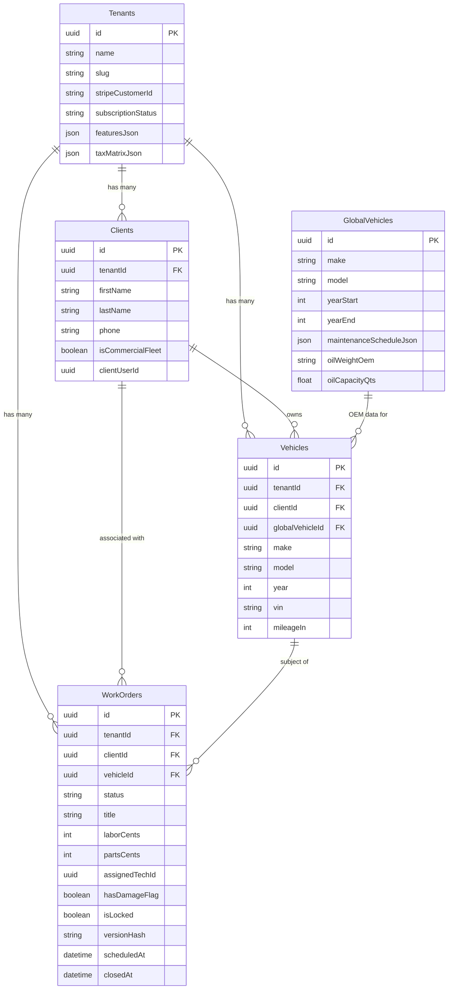
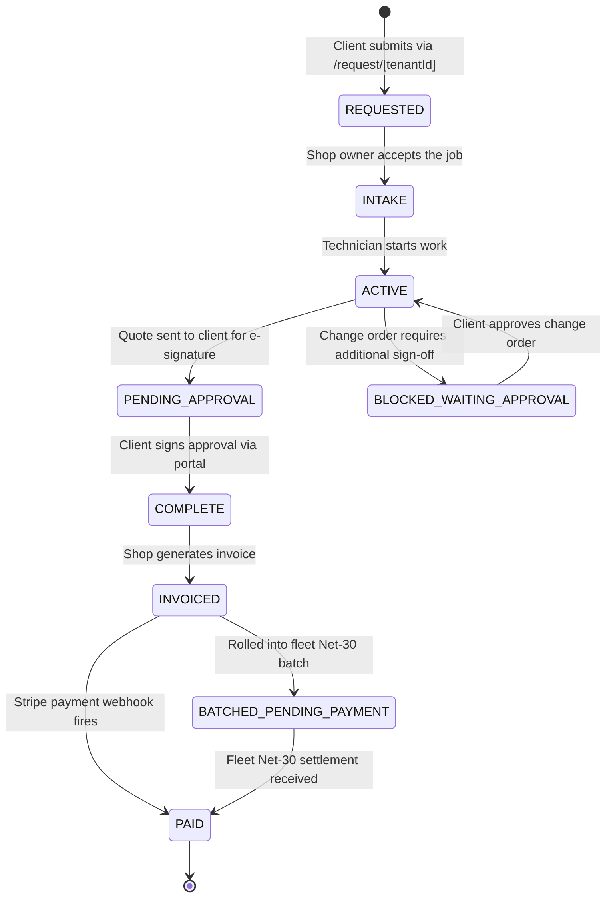

# DriveSync — Technical Architecture

> This document covers the database schema, security model, core data flows, and API adapter patterns that form the backbone of the DriveSync platform.

---

## Table of Contents

1. [Database Schema Diagram](#database-schema-diagram)
2. [Row Level Security & RBAC](#row-level-security--rbac)
3. [The "Wrench Loop" — WorkOrder Lifecycle](#the-wrench-loop--workorder-lifecycle)
4. [API Fallback Logic (Zod Adapter Pattern)](#api-fallback-logic-zod-adapter-pattern)

---

## Database Schema Diagram

The schema is generated and maintained by **Prisma** (ORM) and deployed to Supabase via the SQL migration files in `supabase/migrations/`.



### Key Relationships

| Relationship | Description |
|---|---|
| `Tenants → Clients` | Every client is scoped to a single mechanic shop (tenant). `ON DELETE CASCADE`. |
| `Clients → Vehicles` | A client owns one or more vehicles. |
| `Vehicles → WorkOrders` | Each work order targets a specific vehicle. |
| `GlobalVehicles → Vehicles` | Optional link to the shared OEM data library for maintenance schedules and TSBs. |

---

## Row Level Security & RBAC

DriveSync uses **Supabase Row Level Security (RLS)** with a three-tier **Role-Based Access Control (RBAC)** model. Role assignments are stored in the `user_roles` table (one row per `auth.users` UID).

### Roles

| Role | Who | Access Scope |
|---|---|---|
| `SHOP_OWNER` | The subscribing technician / shop admin | Full read/write on **all** data within their tenant |
| `FIELD_TECH` | An employee technician | Read/write **only** on `WorkOrders` where `assigned_tech_id = auth.uid()` |
| `FLEET_CLIENT` | A commercial fleet portal user | Read-only on `WorkOrders` linked to their specific `clients` row |

### Helper Functions

The RLS policies use two stable `SECURITY DEFINER` functions to avoid per-row subquery overhead:

```sql
-- Returns the current user's role enum value
current_user_role() → user_role

-- Returns the tenant_id scoped to the current user
current_tenant_id() → uuid
```

### Policy Matrix

#### `work_orders` Table

| Operation | `SHOP_OWNER` | `FIELD_TECH` | `FLEET_CLIENT` |
|---|---|---|---|
| `SELECT` | All rows in their tenant | Only rows where `assigned_tech_id = auth.uid()` | Only rows for their client account |
| `INSERT` | ✅ | ✅ | ❌ |
| `UPDATE` | ✅ All columns | ✅ Restricted columns only | ❌ |
| `DELETE` | ✅ | ❌ | ❌ |

#### `clients` Table

| Operation | `SHOP_OWNER` | `FIELD_TECH` | `FLEET_CLIENT` |
|---|---|---|---|
| `SELECT` | All clients in tenant | Clients linked to their assigned work orders | Their own client row only |
| `INSERT` / `UPDATE` | ✅ | ❌ | ❌ |

### SHOP_OWNER vs FIELD_TECH — Practical Differences

**`SHOP_OWNER`** can:
- Create, edit, and delete any work order or client record within their tenant.
- View and approve QA-flagged damage reports (`has_damage_flag = TRUE`) in the Dispatch queue.
- Generate batch fleet invoices and manage Stripe billing settings.
- Configure tenant-level feature flags, tax matrix, and integrations.

**`FIELD_TECH`** can:
- View and update **only the work orders assigned to them** (`assigned_tech_id`).
- Upload pre-inspection walkaround photos and mark the pre-check complete.
- Set the `has_damage_flag` on a work order when pre-existing damage is found.
- Cannot access billing, client management, or any work order not assigned to them.

---

## The "Wrench Loop" — WorkOrder Lifecycle

The WorkOrder `status` field is the single source of truth for a job's position in the shop's workflow. Below is the full state machine:



### Step-by-Step Lifecycle

| # | Status | Actor | What Happens |
|---|---|---|---|
| 1 | `REQUESTED` | Fleet Client / Public | Customer submits a job request via the public intake wizard at `/request/[tenantId]`. A `WorkOrder` row is created with `status = REQUESTED`. |
| 2 | `INTAKE` | Shop Owner | Owner reviews the request, adds vehicle details, and accepts the job. |
| 3 | `ACTIVE` | Field Tech | Tech begins on-site work. If offline, work order edits are stored in IndexedDB by Dexie.js and synced via `/api/sync` when connectivity returns. The server enforces `versionHash` collision detection to prevent stale overwrites. |
| 4 | `PENDING_APPROVAL` | Shop Owner | Owner finalises the quote and triggers `sendQuote()`. A UUID `approvalToken` is generated and an SMS with the portal link is sent via Twilio. |
| 5 | `COMPLETE` | Fleet Client | Client opens the portal (`/portal/[token]`), reviews the quote, signs the liability waiver, and submits their digital signature. Status transitions to `COMPLETE`. |
| 6 | `INVOICED` | Shop Owner | Owner marks the job invoiced. For individual clients this triggers a Stripe Checkout session. |
| 7a | `PAID` (direct) | Stripe Webhook | Stripe fires a `checkout.session.completed` or `invoice.paid` webhook to `/api/stripe/webhook`, setting `status = PAID`. |
| 7b | `BATCHED_PENDING_PAYMENT` | Shop Owner | Fleet accounts are rolled into a batch invoice via `/api/stripe/batch-invoice` (Net-30 terms). Status is `BATCHED_PENDING_PAYMENT` until settlement. |
| 8 | `PAID` (fleet) | Shop Owner | After payment is confirmed the owner manually advances the status to `PAID`. |

### Offline Sync Detail

The `useOfflineSync` hook (Phase 13) handles the `ACTIVE` → server sync path:

1. Tech edits a work order while offline → written to Dexie IndexedDB.
2. Network reconnects → hook POSTs the local snapshot to `/api/sync`.
3. Server compares the incoming `versionHash` against the DB row.
4. **Match** → applies the patch, rotates `versionHash`, returns `200 OK`.
5. **Mismatch** → returns `409 CONFLICT`. The UI shows `SyncConflictModal` and the tech chooses whether to force-push or discard local changes.
6. **Locked** (`status = COMPLETE | INVOICED | PAID`) → returns `409 LOCKED_CONTRACT`. No overwrites allowed on finalized jobs.

---

## API Fallback Logic (Zod Adapter Pattern)

Third-party automotive APIs (CarMD, Nexpart) return inconsistent or evolving JSON shapes. DriveSync wraps every external API call in a **Zod validation adapter** so that malformed payloads never reach the database.

### Pattern: `src/lib/api-adapters/carmd.ts`

```
External API Response
        │
        ▼
  Zod Schema.safeParse()
  ┌─────────────────────────┐
  │  success: true          │──► Validated, typed data → Prisma upsert
  │  success: false         │──► Log warning, return null (caller uses cached data)
  └─────────────────────────┘
```

### How It Works

1. **Define the expected shape** with a Zod schema (e.g., `MaintenanceScheduleSchema` in `src/lib/schemas/maintenance.ts`).
2. **Call `schema.safeParse(rawApiResponse)`** — this never throws.
3. On **success** the typed `data` object is passed to the Prisma upsert into `GlobalVehicles`.
4. On **failure** the validation error is logged for monitoring, and the function returns `null`. The calling route falls back to the cached Lexicon row already in the database.

### Why This Matters

- Prevents a CarMD schema change from corrupting the `GlobalVehicles` table.
- Protects the Postgres `CHECK` constraint on `maintenance_schedule_json` (shape: `[{ mileage: number, tasks: string[] }]`).
- Keeps the application available even when an upstream API is degraded or returns an unexpected payload structure.
